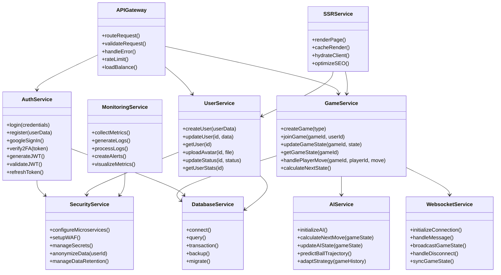

# ft_transcendence

```mermaid
classDiagram
    class AuthService {
        +login(credentials)
        +register(userData)
        +googleSignIn()
        +verify2FA(token)
        +generateJWT()
        +validateJWT()
        +refreshToken()
    }

    class UserService {
        +createUser(userData)
        +updateUser(id, data)
        +getUser(id)
        +uploadAvatar(id, file)
        +updateStatus(id, status)
        +getUserStats(id)
    }

    class GameService {
        +createGame(type)
        +joinGame(gameId, userId)
        +updateGameState(gameId, state)
        +getGameState(gameId)
        +handlePlayerMove(gameId, playerId, move)
        +calculateNextState()
    }

    class AIService {
        +initializeAI()
        +calculateNextMove(gameState)
        +updateAIState(gameState)
        +predictBallTrajectory()
        +adaptStrategy(gameHistory)
    }

    class SecurityService {
        +configureMicroservices()
        +setupWAF()
        +manageSecrets()
        +anonymizeData(userId)
        +manageDataRetention()
    }

    class MonitoringService {
        +collectMetrics()
        +generateLogs()
        +processLogs()
        +createAlerts()
        +visualizeMetrics()
    }

    class DatabaseService {
        +connect()
        +query()
        +transaction()
        +backup()
        +migrate()
    }

    class WebsocketService {
        +initializeConnection()
        +handleMessage()
        +broadcastGameState()
        +handleDisconnect()
        +syncGameState()
    }

    class APIGateway {
        +routeRequest()
        +validateRequest()
        +handleError()
        +rateLimit()
        +loadBalance()
    }

    class SSRService {
        +renderPage()
        +cacheRender()
        +hydrateClient()
        +optimizeSEO()
    }

    GameService --> AIService
    GameService --> WebsocketService
    GameService --> DatabaseService
    AuthService --> SecurityService
    AuthService --> DatabaseService
    UserService --> DatabaseService
    UserService --> SecurityService
    APIGateway --> AuthService
    APIGateway --> GameService
    APIGateway --> UserService
    SSRService --> UserService
    SSRService --> GameService
    MonitoringService --> SecurityService
```
