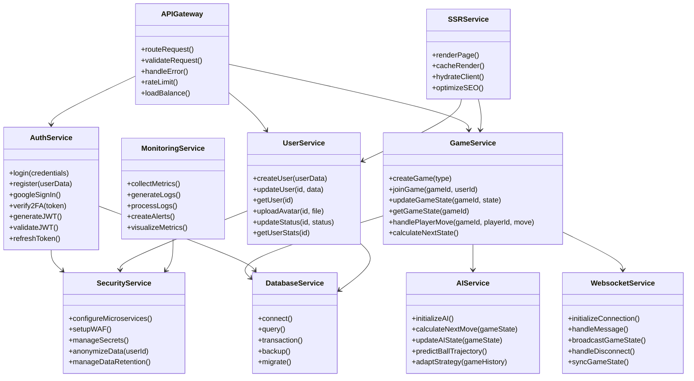

# ft_transcendence

# Team Task Distribution

## Person 1 - Backend & Infrastructure Lead
- Set up Fastify backend framework
- Implement microservices architecture
- Configure Docker containers
- Implement API Gateway
- Integrate SQLite database
- Timeline: 3-4 weeks

**Detailed Tasks:**
1. Initial backend setup with Fastify
2. Design and implement microservices architecture
3. Set up Docker containerization
4. Create database schema and migrations
5. Implement API Gateway with routing and load balancing
6. Set up development and production environments

## Person 2 - Authentication & Security Specialist
- Implement user authentication
- Set up Google Sign-in
- Configure 2FA and JWT
- Implement WAF/ModSecurity
- Set up HashiCorp Vault
- Timeline: 3-4 weeks

**Detailed Tasks:**
1. Basic authentication system implementation
2. Google OAuth integration
3. Two-factor authentication setup
4. JWT implementation and management
5. WAF configuration and security rules
6. HashiCorp Vault integration
7. Security testing and documentation

## Person 3 - Game Logic & AI Developer
- Implement server-side Pong game
- Develop AI opponent system
- Create game state management
- Implement WebSocket communication
- Timeline: 4-5 weeks

**Detailed Tasks:**
1. Core game logic implementation
2. Server-side game state management
3. AI opponent development and testing
4. WebSocket server setup
5. Game synchronization system
6. Performance optimization
7. Game testing and balancing

## Person 4 - Frontend & SSR Developer
- Implement frontend with Tailwind CSS
- Set up SSR integration
- Create responsive UI components
- Implement game visualization
- Timeline: 3-4 weeks

**Detailed Tasks:**
1. Frontend architecture setup
2. SSR implementation
3. UI component development
4. Game interface creation
5. Responsive design implementation
6. Client-side state management
7. Frontend testing and optimization

## Person 5 - DevOps & Monitoring Specialist
- Set up ELK stack
- Implement Prometheus/Grafana
- Configure monitoring systems
- Manage deployment pipeline
- Timeline: 3-4 weeks

**Detailed Tasks:**
1. ELK stack setup and configuration
2. Log management system implementation
3. Prometheus/Grafana setup
4. Monitoring dashboard creation
5. Alert system configuration
6. CI/CD pipeline setup
7. Performance monitoring and optimization

# Cross-Team Responsibilities

## Documentation
- All team members must document their components
- API documentation
- Setup instructions
- Deployment guides

## Testing
- Unit testing for respective components
- Integration testing
- End-to-end testing
- Security testing
- Performance testing

## Communication
- Daily standups
- Weekly progress reviews
- Cross-team code reviews
- Knowledge sharing sessions

# Project Phases

## Phase 1 (Week 1-2)
- Basic infrastructure setup
- Core authentication system
- Initial game implementation
- Frontend foundation

## Phase 2 (Week 3-4)
- AI opponent development
- Security implementation
- SSR integration
- Monitoring setup

## Phase 3 (Week 5-6)
- Feature completion
- Integration testing
- Performance optimization
- Documentation

## Phase 4 (Week 7-8)
- Bug fixing
- Final testing
- Deployment
- Project presentation preparation
